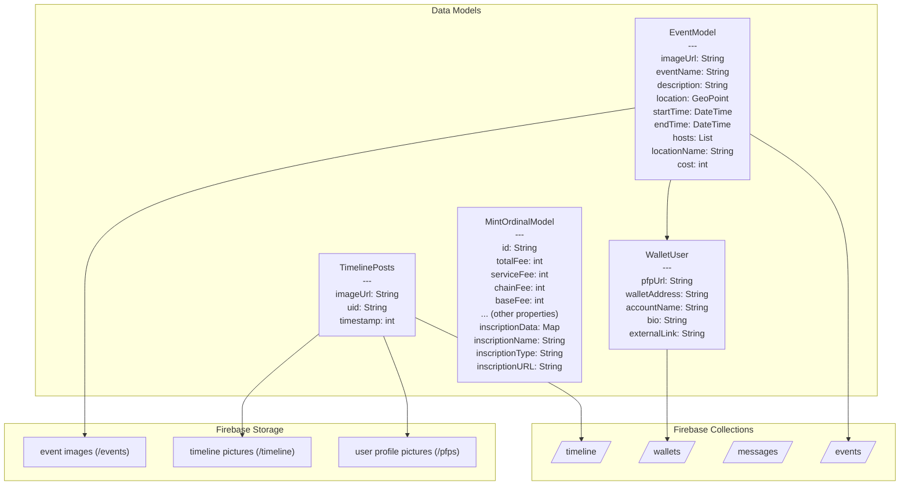

# Alpha Go

Alpha Go is a blockchain-based social application that combines wallet functionality with social event management and community features built with Flutter.


## Overview

Alpha Go is a feature-rich application that combines cryptocurrency wallet management with social features. It enables users to manage their blockchain assets, create and join events, share moments in a social timeline, and interact with other users in the community.

## Key Features

- **Blockchain Wallet**: Secure cryptocurrency wallet with mnemonic phrase creation and import functionality
- **Events Management**: Create, discover, and join events with location-based features
- **Social Timeline**: Share and view moments in a timeline format with image support
- **Ordinal Minting**: Mint Bitcoin ordinals directly through the app
- **User Profiles**: Customizable profiles with wallet integration
- **Biometric Authentication**: Enhanced security with biometric authentication
- **Responsive Design**: Works across various device screen sizes

## Technical Architecture

### Tech Stack
- **Frontend**: Flutter
- **Backend**: Firebase (Authentication, Firestore, Storage)
- **State Management**: GetX
- **Routing**: Go Router
- **Secure Storage**: Shared Preferences
- **Maps & Location**: MapBox integration

## Database Schema

Below is a flowchart representation of the Alpha Go database schema showing models and their relationships with Firebase collections:



### Collection Details

1. **wallets** - Stores user profile information
   - Each document represents a user with wallet address as ID
   - Contains profile data (name, bio, profile picture URL, wallet details)

2. **events** - Stores event information
   - Each document represents a single event with event details
   - References to hosts (as wallet addresses)
   - Contains event metadata (name, description, location, time)

3. **messages** - Stores communication between users
   - Direct messaging functionality

4. **timeline** - Stores user timeline posts
   - Each document represents a post with image URL and timestamp
   - References the user who created the post

### Storage Structure

Firebase Storage is used to store various media files:
- **/pfps** - User profile pictures
- **/events** - Event images
- **/timeline** - Timeline post images

## Application Flow

1. **Onboarding & Authentication**:
   - User creates or imports a wallet using mnemonic phrases
   - Sets up password protection
   - Authentication with biometrics

2. **Main Features**:
   - Home screen with timeline posts and events
   - Wallet management for cryptocurrency assets
   - Event creation and discovery
   - Social interaction with other users

## Getting Started

### Prerequisites
- Flutter SDK (latest version)
- Firebase account and project setup
- Environment configuration

### Installation
1. Clone the repository
```bash
git clone https://github.com/yourusername/alpha_go.git
```

2. Install dependencies
```bash
flutter pub get
```

3. Create a `.env` file in the root directory with your environment variables

4. Run the application
```bash
flutter run
```

## Building for Different Platforms

Alpha Go is a cross-platform application built with Flutter that supports:
- Android
- iOS


## Acknowledgements

- Flutter and Dart teams
- Firebase platform
- All third-party libraries used in this project
